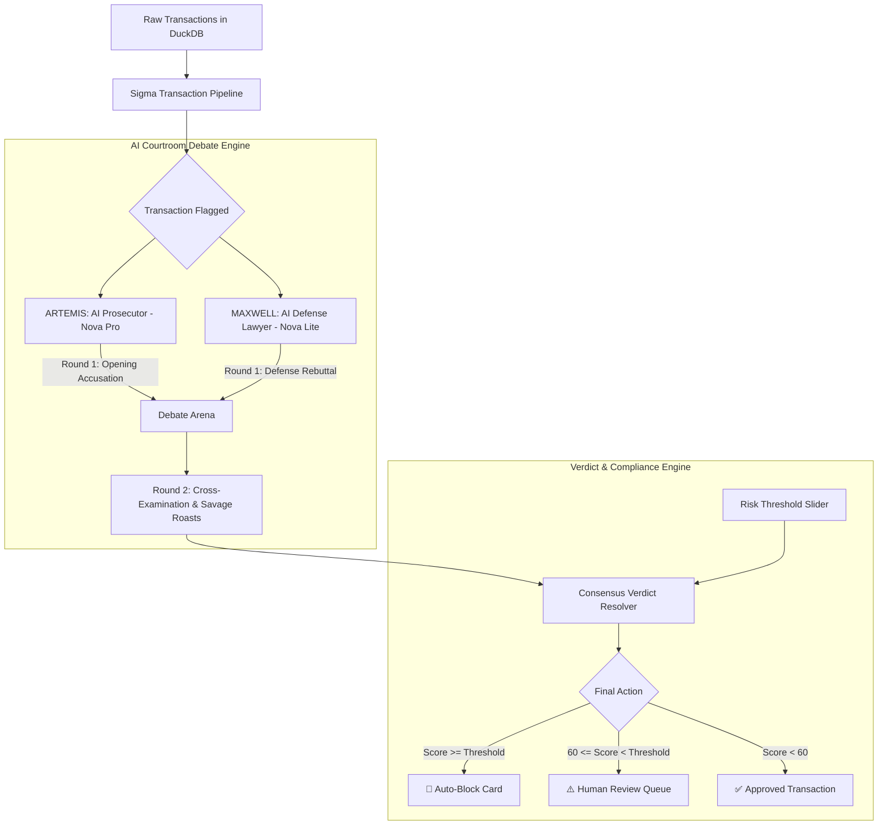

# ⚖️ Fraud Hunter — AI Fraud Detection Platform
### *Sigma DataTech Day 9 AI/Data Engineering Hackathon Project*

Welcome to **Fraud Hunter**, a next-generation banking fraud operations console that introduces a multi-agent generative AI "courtroom debate" inside the transaction validation loop. 

Traditional rule-based fraud engines immediately block credit cards on slight anomalies, causing major customer friction (false positives). **Fraud Hunter** replaces dry automation with an adversarial AI courtroom debate, reducing manual operational review times from **2 hours down to milliseconds** while keeping the ultimate decision transparent, explainable, and fun.

---

## 🚀 Key Architecture & Workflow



---

## 🔥 Hackathon-Killer Features

### 1. 🎭 The AI Courtroom Arena (Dynamic & Bilingual)
* **ARTEMIS (The Prosecutor / Powered by Bedrock Nova Pro):** A ruthless, caffeine-deprived fraud hunter who treats every tiny anomaly as a global mastermind scam.
* **MAXWELL (The Defense / Powered by Bedrock Nova Lite):** A smooth, charming attorney who protects innocent customers by exposing system pipeline glitches and dirty database errors.
* **Savage Bollywood Flavor:** Prompts are dynamically tuned so both AIs debate in a dramatic mix of **English and Bollywood-style Hindi/Hinglish**, roasting each other's technical arguments.

### 2. 🚨 Intelligent AI Disagreement Detection
* If the Prosecutor calculates a high risk score ($\text{Risk} > 70\%$) but the Defense discovers a high false-positive probability ($\text{FP} > 65\%$), the platform dynamically flashes a high-visibility warning: **`⚠ Strong AI Disagreement Detected`**.
* This isolates high-priority grey areas, allowing human investigators to instantly focus their attention on where it is actually needed.

### 3. 🎛️ Live Verdict Sensitivity Control
* An interactive sidebar slider lets compliance officers tune the **Verdict Threshold** (default: `85`) dynamically.
* Instantly shifts transaction verdicts between **Approved (Legitimate)**, **Review (Investigate)**, and **Auto-Block (Fraud)** in real time.

### 4. 🪤 Real-world Data Trap Handling (The "Data Explorer")
* Built on a super-fast **DuckDB local database backend**.
* Hardened against dirty production data traps including:
  * **TXN020 (The Time-Travel Trap):** An impossible future date (`December 31, 2099`) for a ₹99,999 Swiggy order. The AI Defense exposes this as an ETL timestamp sync error, saving a high-value customer from being blocked.
  * **TXN012 (The Duplicate Trap):** Identical transactions processed twice, exposing transaction-pipe duplication bugs.
  * **TXN011 (The Negative Trap):** A negative transaction amount (`-₹50`), capturing dirty payload bugs.

---

## 🛠️ Project Structure

```bash
team1_fraud_hunter/
├── starter.py          # Main Streamlit Dashboard (UI, Charts, and Chat Bubbles)
├── fraud_engine.py     # AI Debate orchestration and programmatic verdict resolver
├── prompts.py          # Savagely detailed dramatic bilingual system prompts
├── utils.py            # High-performance DuckDB query utility functions
└── README.md           # Project Documentation (You are here!)
```

---

## 🚦 Getting Started & Local Setup

### 1. Prerequisites
Ensure you have the virtual environment activated and the DuckDB database initialized.
To setup the database:
```bash
python ../shared/setup_duckdb.py
```

### 2. Run the Streamlit Application
Start the server locally using the specific project virtual environment interpreter:
```bash
../../.venv/bin/python -m streamlit run starter.py --server.port 8503 --server.headless true
```
Open your browser and navigate to: `http://localhost:8503`

---

## 📊 Demo Guide for Presenters
1. **The Hook:** Select **`TXN020`** (default) from the sidebar. Point out the absurd date (`2099`) and amount.
2. **The Battle:** Click on the **AI Courtroom** tab. Watch the AIs trade blows in Hinglish. Note the dynamic **AI Disagreement Warning** flashing.
3. **The Control:** Slide the **Verdict Threshold** in the sidebar. Show how it dynamically shifts the final verdict status.
4. **The Value:** Go to the **Analytics** tab. Highlight the **Blocked Legitimate Customers** card to prove the direct business revenue saved.
5. **The Tech:** Open the **Data Explorer** tab to showcase the robust raw data queries running directly over **DuckDB**.
